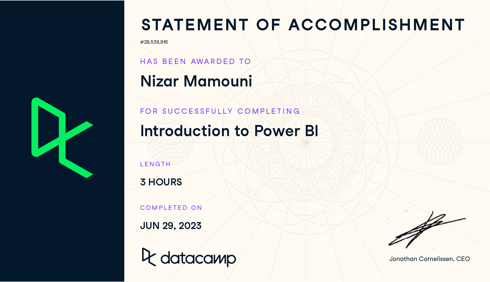

<!--## Hello, World of Data-Driven Discovery, I’m Nizar Mamouni-->
<h5 align="center">
    
</h5>

- 💡 I'm a master’s graduate in Data Science & Business Analytics from UNC Charlotte, specializing in data management and predictive analytics.
- 🎓 Earned my stripes in Mathematics for Business at UNC Charlotte, diving deep into the world of numbers and analysis.
- 🔍 Skilled in Python, SAS, SQL, and adept at machine learning, my toolbox is well-equipped for the modern data challenges.
- 📊 Currently enriching decision-making at Mecklenburg County as a Data Analyst Intern, where I transform complex data sets into actionable insights.
- 🤖 From predicting Zomato restaurant ratings to analyzing Spotify's most streamed songs of 2023, my projects demonstrate a flair for turning data into decisions.
- 🌍 Passionate about harnessing the power of data to drive innovation and insightful business strategies, ready to explore new horizons in the world of data-driven discovery.
## My Skills

  <table>
    <thead>
      <tr>
        <th>Core Skills</th>
        <th>Languages/Tools</th>
        <th>Toolkits</th>
        <th>Soft Skills</th>
        <th>Certifications</th>
      </tr>
    </thead>
    <tbody>
      <tr>
        <td>Data management</td>
        <td>Python</td>
        <td>Numpy</td>
        <td>Communication (4 languages)</td>
        <td>Certified in Applied Machine Learning</td>
      </tr>
      <tr>
        <td>Data mining</td>
        <td>SAS</td>
        <td>Pandas</td>
        <td>Collaboration</td>
        <td>Big Data Design and Provenance</td>
      </tr>
      <tr>
        <td>Machine learning</td>
        <td>SQL</td>
        <td>Matplotlib</td>
        <td>Critical Thinking</td>
        <td>Visual Analytics with Power BI and Tableau</td>
      </tr>
      <tr>
        <td>Predictive analytics</td>
        <td>R</td>
        <td>TensorFlow</td>
        <td>Curiosity & Creativity</td>
        <td>AI Applications in Healthcare</td>
      </tr>
      <tr>
        <td>Applied Machine Learning Techniques</td>
        <td>ggplot</td>
        <td>Keras</td>
        <td>Storytelling with Data</td>
        <td>Image Processing in Python</td>
      </tr>
      <tr>
        <td>Big Data Design, Storage, and Provenance</td>
        <td>Tableau</td>
        <td>Scikit-learn</td>
        <td>Analytical Storytelling</td>
        <td>Data Manipulation in SQL</td>
      </tr>
      <tr>
        <td>Visual Analytics Techniques</td>
        <td>Vega-lite</td>
        <td>PyTorch</td>
        <td>Data-driven Decision Making</td>
        <td>Exploratory Data Analysis in SQL</td>
      </tr>
      <tr>
        <td>Artificial Intelligence in Healthcare</td>
        <td>PowerBI</td>
        <td>NoSQL Databases</td>
        <td>Problem Solving</td>
        <td>Intermediate Deep Learning with PyTorch</td>
      </tr>
      <tr>
        <td>Data Preparation and Processing</td>
        <td></td>
        <td></td>
        <td>Collaboration</td>
        <td>Deep Learning for Images with PyTorch</td>
      </tr>
      <tr>
        <td>Data Visualization and Communication</td>
        <td></td>
        <td></td>
        <td>Ethical Judgment</td>
        <td>Introduction to Relational Databases in SQL</td>
      </tr>
    </tbody>
  </table>

 

## Certifications
<table>
  <tr>
<td width="30%">
  
  </td>
  
<td width="30%">
   
  </td>
  
<td  width="30%">
   
  </td>
  </tr>
  
  
  
  <tr>
<td width="30%">
  
  </td>
  
<td width="30%">
   
  </td>
  
<td  width="30%">
   
  </td>
  </tr>
  
  
  
 <tr>
<td width="30%">
  
  </td>
  
<td width="30%">
   
  </td>
  
<td  width="30%">
   
  </td>
  </tr>

    
 <tr>
<td width="30%">
  
  </td>
  
<td width="30%">
   
  </td>
  
<td  width="30%">
   
  </td>
  </tr>
  
  
      
 <tr>
<td width="30%">
  
  </td>
  

  </tr>
  
  
</table>
 
<h3>Connect Me On:</h3>

 

  

<h3>💻 GitHub Profile Stats</h3>

----
	

    
	  
 

<!-- 

  

 -->
